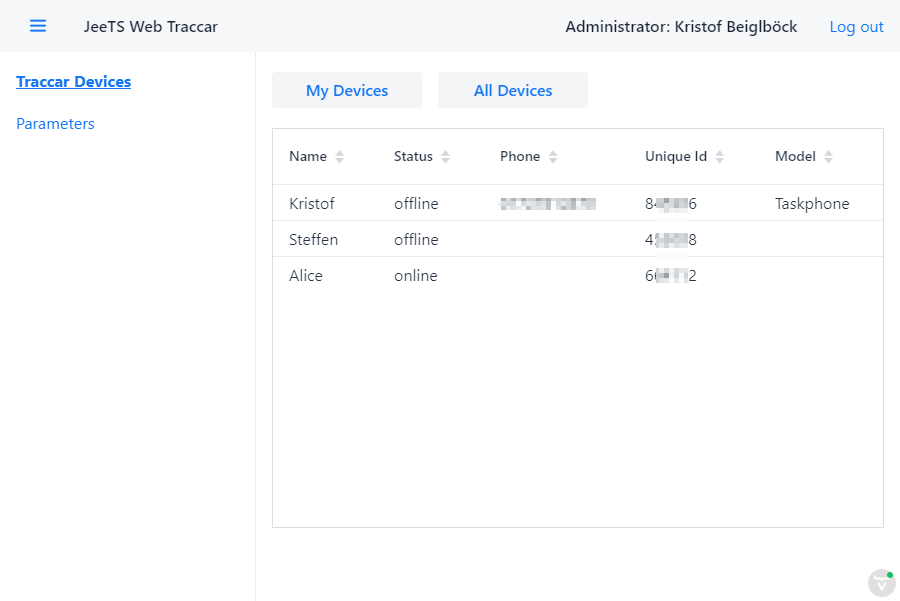

[[web-vaadin-arc]]

:toc:

= Vaadin Architecture

This project provides a starter to create your own Traccar Frontend - rapidly.
It implies the `jeets-web-spring-traccar` project 
which controls the embedded Tomcat Servlet Engine
and has a built in *Open API Client for Traccar*.

== Vaadin Framework

If you don't know the Vaadin Framework yet you should visit the 
link:https://vaadin.com/[vaadin website] 
full of material to get started, learn and build.
You might want to download their  
link:https://vaadin.com/start[starter application]:
*Starting point for Vaadin 14 applications with Spring Boot*.
If you install this starter project parallel to this project
you should quickly get oriented and start coding.

This document only covers the major mile stones from this 
link:https://vaadin.com/learn/tutorials/modern-web-apps-with-spring-boot-and-vaadin[Vaadin Tutorial]: +
"This guide is a practical introduction to web application development with Spring Boot and Vaadin.
It covers the entire development process, from setup to deployment, following a step-by-step approach. 
The content is suitable for anyone familiar with Java who wants to build a web application."

WARNING: Please note that Vaadin provides free Open Source and commercial components! +
If you decide to use the commercial products you need to get a license before going live. +
The JeeTS Web only uses the free components unless dedicated customers ask for more.

== Simple Architecture

The `jeets-web-vaadin` project demonstrates 
how to create a project from a multi-project Maven structure
in order to focus on different aspects of a software.
In this project on the presentation layer, 
which is basically build with four Java classes in the `ui` packages:

    org.jeets.web.vaadin.ui.MainLayout
    org.jeets.web.vaadin.ui.views.LoginView
    org.jeets.web.vaadin.ui.views.DeviceView
    org.jeets.web.vaadin.ui.views.ListView

=== Login with Spring Security

In the 
link:https://vaadin.com/learn/tutorials/modern-web-apps-with-spring-boot-and-vaadin[Vaadin Tutorial]
you should go through the chapter:
*Adding a login screen to a Vaadin app with Spring Security*
to identify the classes for Vaadin with Spring Security
in the package `org.jeets.web.vaadin.security`.

Note that the `Application` class is placed in the top level package `org.jeets.web` in order to automatically scan the sub packages from the `jeets-web-spring-traccar` project.

Also note that the `LoginView` applies a Vaadin ready to use `LoginForm`
which is already wired to Spring. The actual authentication process
is directed to our Open API client 

    public class TraccarAuthenticationProvider implements AuthenticationProvider {
        @Override
        public Authentication authenticate(Authentication authentication) { .. }

and takes care of creating an authenticated http instance,
authenticates the user against it and creates our 
Spring Role Secured `TraccarModel`.
If this sequence is successful the model instance is ready to be used
over the complete session - as we will see proceeding to the chapter
*Vaadin basics: building UIs with components and layouts*.

// TODO Evaluate against / replaces? @Model with ModelAttributes

=== MainLayout

This class defines the main page for the single-page application (SPA) 
extended from Vaadin's `AppLayout`. +
The `@CssImport` defines a style sheet to design the browser appearance.

[source,java]
----
@CssImport("./styles/shared-styles.css")
public class MainLayout extends AppLayout {

	private TraccarModel traccarModel;

	public MainLayout( TraccarModel model) {
		traccarModel = model;
		createHeader();
		  :
	}
----

The heart or an MVC application is the Model 
and in this case the `TraccarModel` annotated as session scoped service

[source,java]
----
	@Service
	@SessionScope
	public class TraccarModel {
----

In order to create a View with the Model you simply define the `TraccarModel` 
as a class member and the instance is automatically picked up by Spring in the 
constructor. After referencing the instance the Model can be used 
to retrieve any data from your Traccar Server.
For the main window we simply get User Information to display in the header.

[source,java]
----
	private void createHeader() {
		  :
		String userName = TraccarAuthentication.getTraccarUser().getName();
		String userRole = traccarModel.getRoleString();
		  :
	}
----

Note that we are using the static `TraccarAuthentication` class
_to check the authentication live_ at any time,
while the `TraccarModel` instance is actually retrieving 
and collecting infos from the remote server internally.

=== Views

The Tutorial chapter *Navigating between views in Vaadin* describes 
the `MainLayout` and `*View` class mechanisms of user navigation 
in the browser. This View is based on Vaadin's Component `VerticalLayout`.

[source,java]
----
	@Route(value = "", layout = MainLayout.class)
	@PageTitle("Traccar Devices | JeeTS Web")
	public class DeviceView extends VerticalLayout {
----

In Vaadin the `@Route` annotation defines the page link.
This View is mapped to the "" link, i.e. the domain name and
is displayed as the initial view of all devices available
for the logged in user.

How did they get there?

In the creation process of the Traccar Model a first `requestUserDevices`
is sent to the server to retrieve the User's devices.
After retrieval these devices are available via `traccarModel.getDevices()`
which refers to the _static_ Traccar Model.

=== Role Based Elements

If you do have a Traccar Server running on your local machine or anywhere else
and you also have credentials for administration go ahead to configre the server 
and log into it via Vaadin.

In the image you can see the complete Frontend Design with the features

 * Link Navigation on the left side (can be collapsed)

 * Logged in User and Role
 
 * Role Based Vaadin Spring Session with internal Traccar connection
 
 * Role Based Elements
 
 * Sortable table
 
 * Responsive Design +
   Simply resize the browser window and see what happens.

Let's look at the code and see how 
elements can be displayed for different roles ...

    if (TraccarAuthentication.isAdminOrManager())
        header.add(createAllDevicesButton());

and that's all it takes.

It makes sense to start the initial design with a normal User and 
although it is predefined with `TraccarAuthentication.isUser()`
you don't need to apply it as the normal User is the default role.
(We might add a visitor role at some point.) 
`TraccarAuthentication` defines the three Traccar roles for you
and aligns them with Spring Security.
Since some methods equally work for Admins and Managers you can
sometimes use `isAdminOrManager` as listed in the code above.
We don't want a User to even see elements not meant for his use.

== Roadmap

Now the JeeTS Vaadin project is in place and released as v1.0
and we should delay further development at this point.

Why?

We know that the Model is the core of every application 
and its worth while to improve this fundamental structure.
We have created a project to request Traccar Devices
being the main Entity - the Trackers of a Tracking System.

So we could continue adding similar methods for the other
System Entities displayed in the 
link:https://github.com/kbeigl/jeets/tree/master/jeets-models/jeets-pu-traccar#entity-relation-model[Entity Relation Model (ERM)].
But there is another extremely convenient Model Structure 
defined by the Java Persistence Architecture (JPA) -
the Persistence Unit (PU). A PU applies Object Relations
inside the programming language 
to create an *Object Relations Model (ORM)*.

Knowing that the Vaadin Project and the `TraccarModel` 
only needs to create the device list `List<Device>` 
to get a hold of all (accessible) devices.
From there on we can filter the list or loop over the devices
as a start. Then the presentation can use this device to 
access its attributes via ORM navigation.

In order to achieve this the Entities of the Open API client,
like `org.openapitools.client.model.Device` will be 
replaced with the Persistence Unit of the JeeTS repository.
Then we can use the same PU on server and client side 
without loosing any information.
On server side the PU is managed by an `EntityManager`
while the ORM on client side can be filled and held
with consecutive requests to the server.

Stay tuned!

